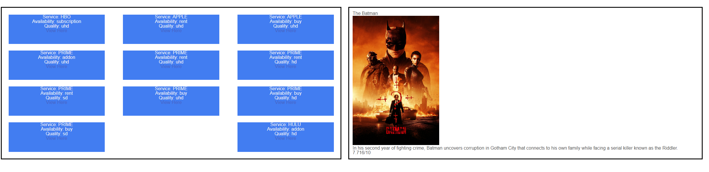
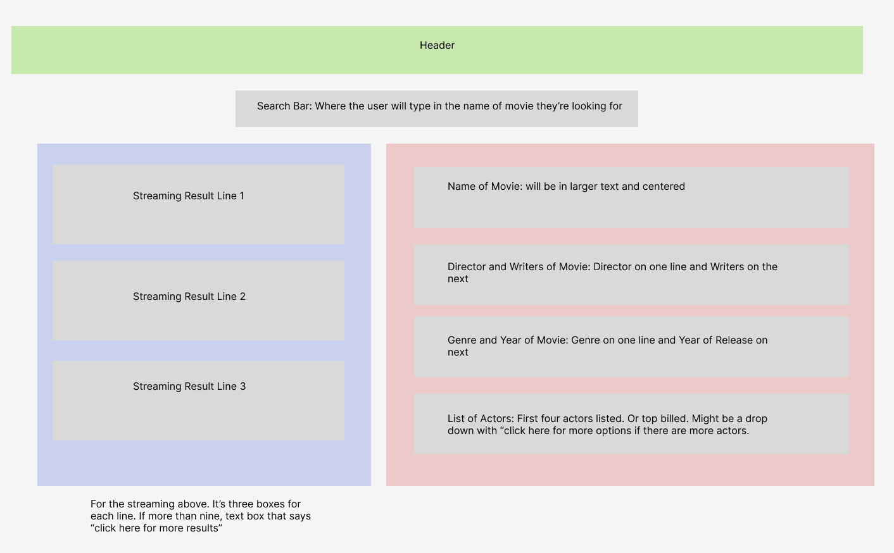

# Movie_Search

Live site : https://jbird11801.github.io/Movie_Search/

## Description

Have you ever sat down , and wanted to watch a movie but had no idea what streaming site its on no problem. simply look up what movie you want and be amazed to see what streaming service its on.

## Usage

Simply input a show or movie into the search

Then look at the results to find information the content and where to watch it with a link to that site

## Credits

Used to make the read me file https://courses.bootcampspot.com/courses/3906/pages/3-dot-5-3-create-a-professional-project-readme?module_item_id=885925

used figma to make wire frame https://www.figma.com

tmbd api https://developer.themoviedb.org/docs/getting-started

rapid api https://rapidapi.com/movie-of-the-night-movie-of-the-night-default/api/streaming-availability

Used Jqury and Jqury ui https://jquery.com/

Used to learn about .remove() https://developer.mozilla.org/en-US/docs/Web/API/Element/remove

Used bulma frame work https://bulma.io/

Used to help with the auto complete https://jqueryui.com/autocomplete/

## Mock up

Group Idea movie search that give you list of actors and where to watch the movie

tmdb access-key: 8694646e178523a682ccf1e052b4a1dc

rapid access-key: 89e7e8bb73msha528c083647ebbfp158eedjsne3b14326664d

## user story

AS a movie watcher,

I WANT to be able to know a movie's information,

SO I know where I can watch it and what it is about.

when i look up a movie

then i get info on that movie

## breakdow of tasks

Please refrence project bored for deligation of tasks https://github.com/users/jbird11801/projects/1

## License

please refrence LICENSE file

